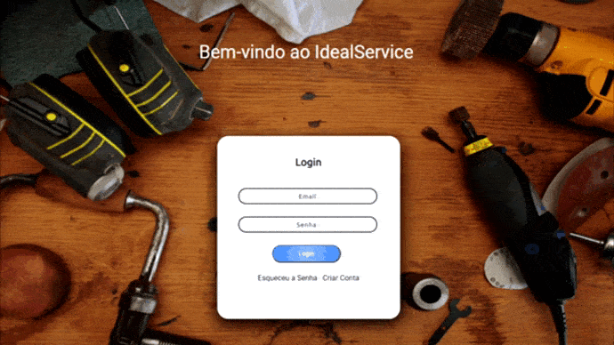

<h1 align="center">Ideal Service</h1>

<!-- Mudar de acordo com o projeto -->

  
  

<!-- Descrição -->

    O "Ideal Service" foi desenvolvido como projeto final do Curso Técnico de Desenvolvimento de Sistemas do SENAI. Ele serve como um intermediador entre uma pessoa que está a procura de algum profissional e um prestador de serviços, aonde você consegue buscar por profissionais ou até mesmo anúnciar o seu próprio trabalho.
      
    Obs: A maior parte do projeto é feito em C# / ASP.NET, porem como as bibliotecas e dependências são feitas em JavaScript, ela acabou sendo a linguagem mais usada.

<!-- Imagem ou GIF da tela do projeto -->

    Gif mostrando as telas:

    

 

## 📝 Funcionalidades: 

- CRUD de contas
- CRUD de anúncios
- Recuperação de senha
- Confirmação de Email
- Envio de email para o suporte
- API do WhatsApp​ para entrar em contato.
- Comentários em anúncios
- Upload / Visualização de fotos
- Aprovar / Reprovar anúncios (ADM)
- Banir contas (ADM)
- Excluir anúncio (ADM)​

 

## 🚀 Tecnologias

- C#
- ASP.NET
- MySQL
- JavaScript
- HTML 
- CSS
- Bootstrap 
 

